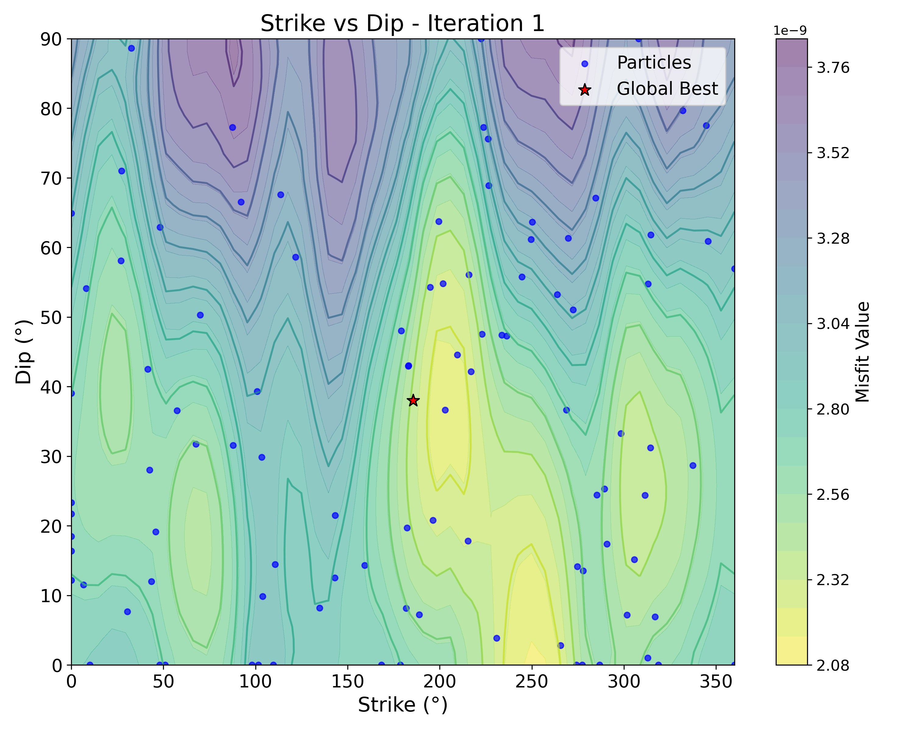
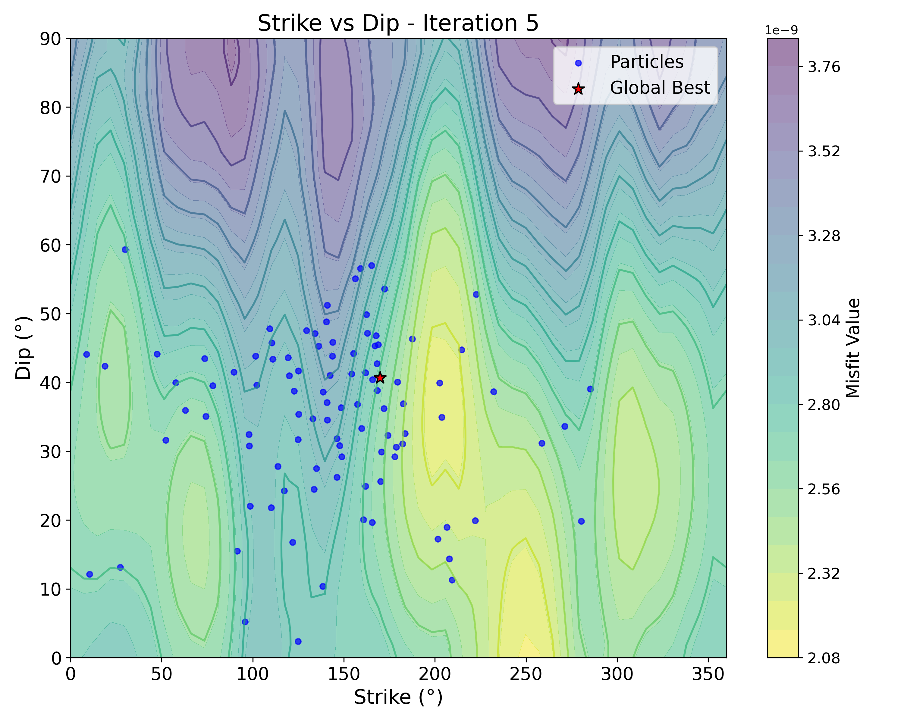
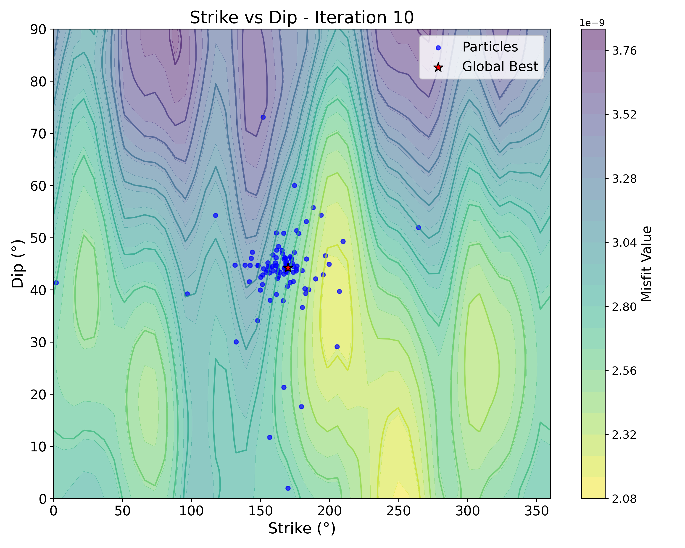
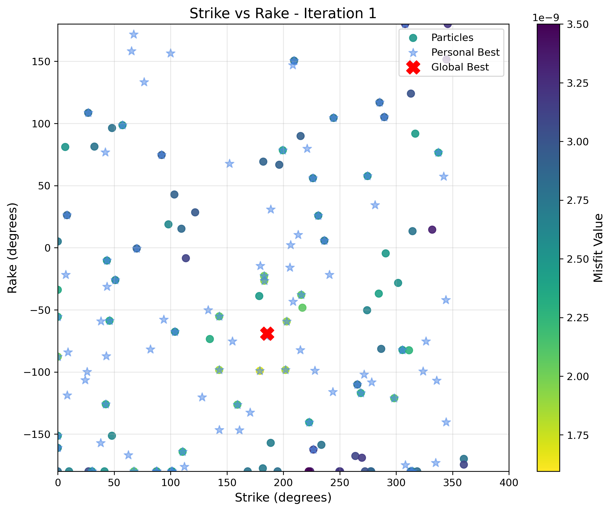
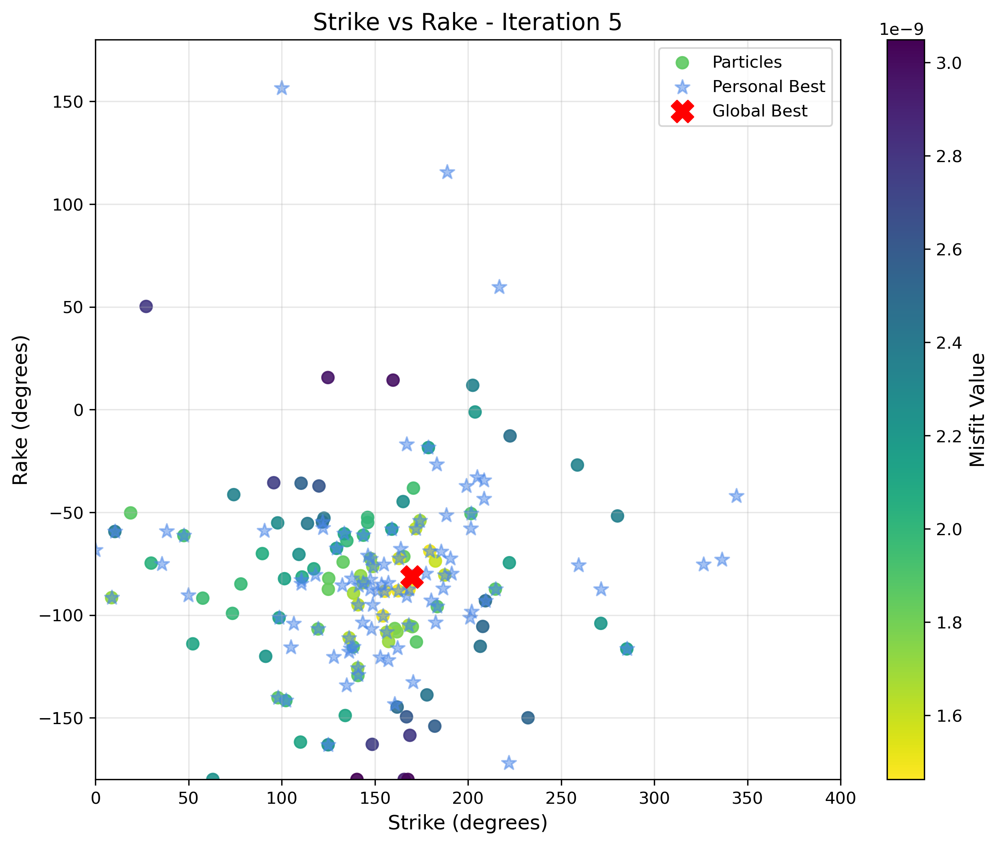
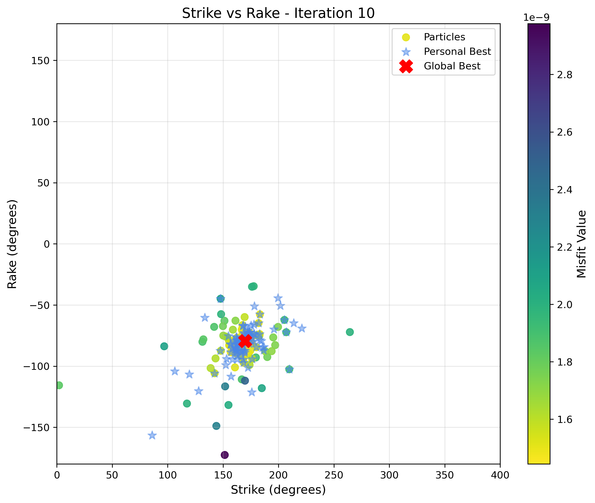

# mtuq_pso

**mtuq_pso** - A set of scripts to apply **P**article **S**warm **O**ptimization ([PSO](https://en.wikipedia.org/wiki/Particle_swarm_optimization)) for moment tensor inversion in [MTUQ](https://github.com/uafgeotools/mtuq).

---

> **Status**: This repository provides working PSO implementations for moment tensor inversion. The scripts include double-couple constrained inversion (with fixed or variable magnitude) and full moment tensor inversion. Please feel free to open an issue if you encounter any problems.

## Overview

PSO is a population-based metaheuristic optimization technique that efficiently searches the parameter space by maintaining a swarm of candidate solutions (particles). Each particle explores the search space and shares information about good solutions, enabling rapid convergence to optimal moment tensor parameters.

**Advantages over grid search:**
- Significantly faster convergence (typically ~5,000 evaluations vs. 288,000+ for grid search)
- Handles high-dimensional problems efficiently (full MT + magnitude = 7D)
- Adaptively focuses search effort in promising regions
- Naturally parallelizable with MPI

## Installation

As this repository is intended to be used with MTUQ, it is required to have MTUQ installed first. The installation instructions for the latest version of MTUQ can be found [here](https://uafgeotools.github.io/mtuq/install/index.html). We recommend using **conda** / **mamba** to manage your environment for MTUQ.

Once MTUQ is installed, the following steps can be followed to use these scripts:

1. **Clone this repository:**
   ```bash
   git clone https://github.com/anetmariap/mtuq_pso.git
   cd mtuq_pso
   ```

2. **Activate the environment in which MTUQ is installed:**
   ```bash
   conda activate your_mtuq_env
   ```

3. **Install additional dependencies (if needed):**
   ```bash
   pip install mpi4py
   ```

## Usage

After installation, the PSO scripts can be used directly for moment tensor inversion. Three main scripts are provided:

### 1. Double-Couple with Magnitude Search (MPI)
```bash
mpirun -n 4 python grid_search.py
```
Simultaneous optimization of strike, dip, rake, and magnitude. Recommended for cases where magnitude is uncertain.

### 2. Full Moment Tensor Inversion (MPI)
```bash
mpirun -n 4 python fmt_pso.py
```
General moment tensor inversion without double-couple constraint. Suitable for non-double-couple sources (e.g., explosions, collapses, volcanic events).

Refer to the example script in `examples/run_pso_example.sh` for a complete workflow demonstration.

## Example Results

### Waveform Fit

*Observed (black) vs. synthetic (red) waveforms showing excellent fit across multiple stations*

### PSO Convergence Visualization

<table>
<tr>
<td></td>
<td></td>
<td></td>
</tr>
<tr>
<td align="center"><b>Iteration 1</b><br/>Initial exploration</td>
<td align="center"><b>Iteration 5</b><br/>Convergence begins</td>
<td align="center"><b>Iteration 10</b><br/>Near optimal</td>
</tr>
</table>


*Strike vs Dip: Particles explore the misfit landscape (color scale) and rapidly identify the global minimum*

<table>
<tr>
<td></td>
<td></td>
<td></td>
</tr>
<tr>
<td align="center"><b>Iteration 1</b><br/>Random distribution</td>
<td align="center"><b>Iteration 5</b><br/>Clustering starts</td>
<td align="center"><b>Iteration 10</b><br/>Converged</td>
</tr>
</table>
*Strike vs Rake: PSO particles converge from random initialization to the optimal solution within ~10 iterations*

## Customization

Each script can be easily customized by modifying key parameters:

```python
# PSO parameters
swarmsize = 100        # Number of particles
maxiter = 50          # Maximum iterations
stagnation_limit = 10 # Patience for convergence

# Data processing
freq_min = 0.1        # Filter parameters
freq_max = 0.333
window_length = 15.0  # Window length in seconds

# Magnitude search range (for PSO_magnitudesearch.py and FMT_PSO.py)
magnitude_min = 4.0
magnitude_max = 5.5
```

If you encounter any issues, have questions, or want to suggest improvements, please do not hesitate to [open an issue](https://github.com/anetmariap/mtuq_pso/issues).

## License

This repository is licensed under the MIT License. See the [LICENSE](LICENSE) file for more information.
